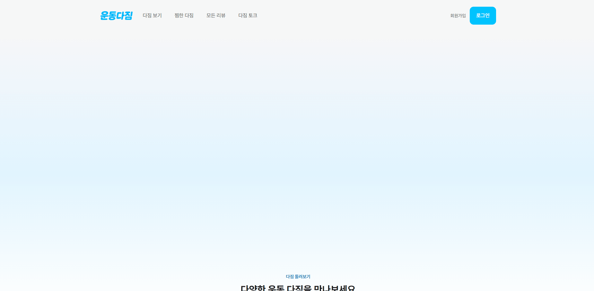
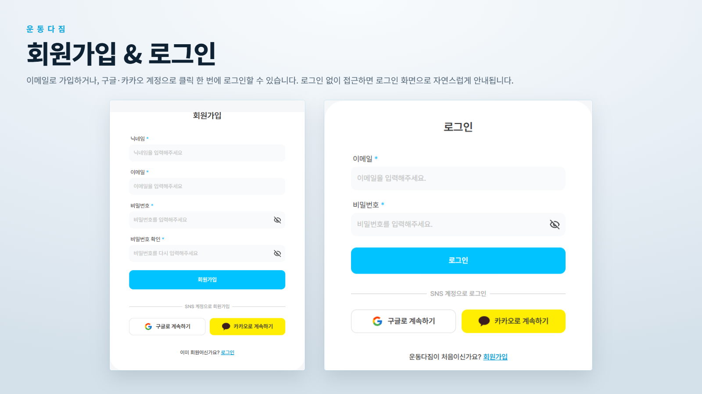
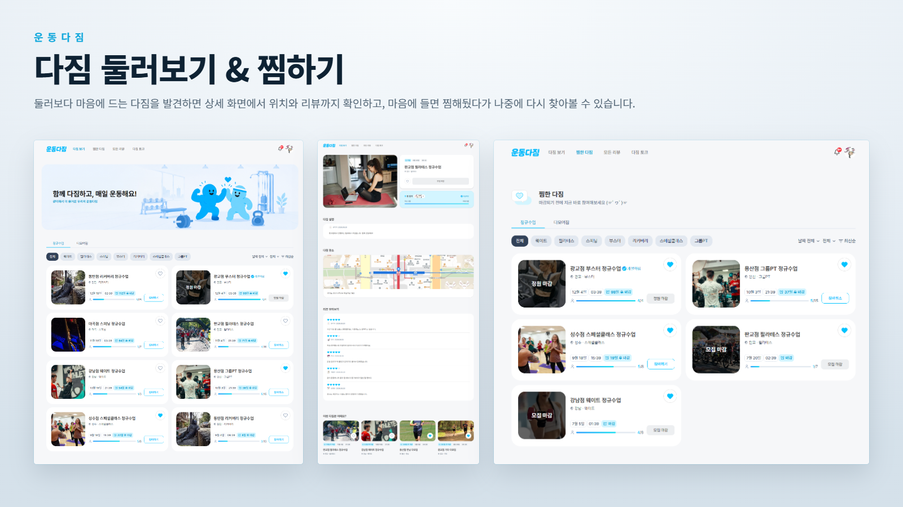
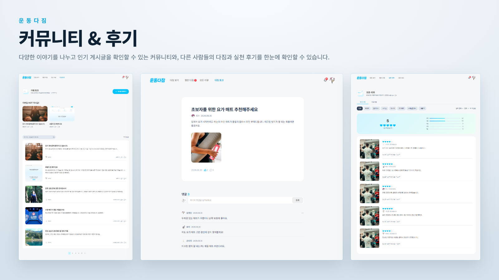
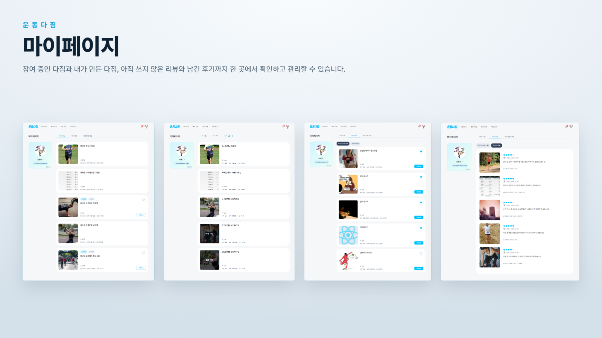
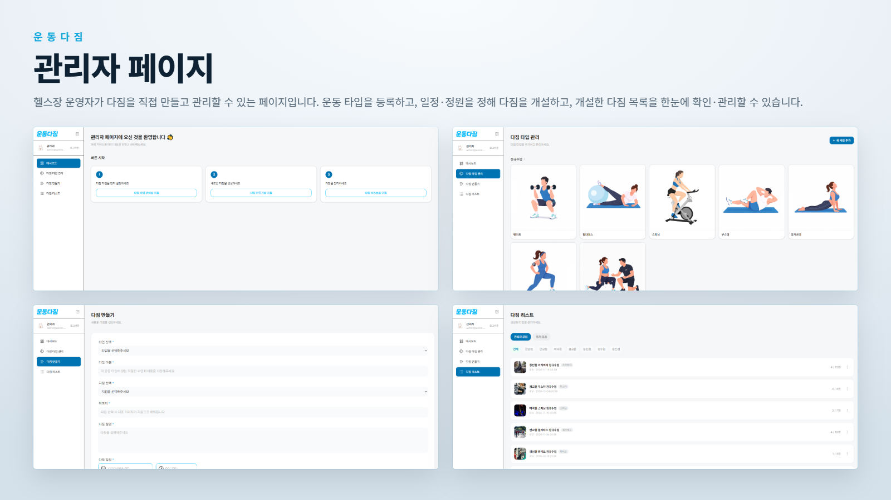

# 운동다짐 (Undongda Gym)

## 기술 스택

#### Frontend

   

#### Data & UI

   

#### Integrations

  

#### Tooling

   

---

## 프로젝트 소개

**혼자가 아닌, 함께하는 운동** — 같이 다짐하고 서로 동기부여하며 끝까지 가는 운동 습관을 위해, 그룹 운동(1:n PT)이라는 방법을 제안하는 서비스입니다.

### 주제 선정 이유

- 1:1 PT는 비용 부담이 커 운동 시작 문턱이 높다
- 혼자 운동하면 동기부여가 약해 작심삼일로 끝난다
- 트레이너 1명이 회원 1명만 담당하면 운영 효율이 떨어진다

### 해결 방안 - 함께하는 다짐

- 헬스장이 시간대별 그룹 운동(`다짐`)을 개설하고, 회원이 예약해 함께 참여
- 트레이너 1명이 여러 회원을 동시에 케어 → 운영 효율 ↑ · 비용 ↓
- `같이 하는 사람이 있다`는 동기부여로 지속률 향상

### 누구를 위한 서비스인가

| 대상                | 내용                                    |
| ------------------- | --------------------------------------- |
| 회원 (B2C)          | 다짐 예약 · 운동 기록 · 리뷰 · 커뮤니티 |
| 헬스장 운영자 (B2B) | 관리자 페이지에서 다짐을 직접 개설·운영 |

### 프로젝트 정보

| 항목      | 내용                                                                    |
| --------- | ----------------------------------------------------------------------- |
| 개발 기간 | 2026.05.14 ~ 2026.06.23 (팀 프로젝트 스프린트), 이후 개인 유지보수 지속 |
| 인원      | 3인 (팀장 1명, 팀원 2명)                                                |

---

## 팀 소개

<table>
  <tr>
    <td align="center">
      <a href="https://github.com/handy-o">
        <br />
        <sub><b>한도윤</b></sub>
      </a>
    </td>
    <td align="center">
      <a href="https://github.com/YangMinYeol">
        <br />
        <sub><b>양민열</b></sub>
      </a>
    </td>
    <td align="center">
      <a href="https://github.com/hwangdae">
        <br />
        <sub><b>황대성</b></sub>
      </a>
    </td>
  </tr>
  <tr>
    <td valign="top">
      • 인증 아키텍처<br />
      • 관리자 페이지<br />
      • 알림<br />
      • 운동일지
    </td>
    <td valign="top">
      • 랜딩 페이지<br />
      • 다짐 보기(목록)<br />
      • 찜한 다짐 · 모든 리뷰<br />
      • 다짐 토크(게시판) · 마이페이지
    </td>
    <td valign="top">
      • 디자인 시스템<br />
      • 인증 아키텍처<br />
      • 회원가입 · 로그인<br />
      • 다짐 상세보기
    </td>
  </tr>
</table>

---

## 실행 방법 & 테스트 계정

### 배포 사이트에서 바로 체험하기

**배포 링크**: [https://undongda-gym.vercel.app/](https://undongda-gym.vercel.app/)

로컬 실행 없이, 아래 테스트 계정으로 배포 사이트에서 바로 로그인해 확인할 수 있습니다.

| 구분   | 이메일               | 비밀번호                                              |
| ------ | -------------------- | ----------------------------------------------------- |
| 관리자 | `admin@admin.com`    | <details><summary>보기</summary>admin123!</details>   |
| 회원   | `rocket@example.com` | <details><summary>보기</summary>password123</details> |

<details>
<summary><strong>로컬에서 실행하기</strong> (코드를 직접 보면서 실행해보고 싶다면)</summary>

> Node.js >= 22, pnpm 필요

```bash
pnpm install
pnpm dev
```

**주요 스크립트**

```bash
pnpm dev      # 개발 서버 실행
pnpm build    # 프로덕션 빌드
pnpm start    # 프로덕션 서버 실행
pnpm lint     # 린트 검사
pnpm test     # Jest 테스트 실행
```

</details>

---

## 데모 & 핵심 기능

### 랜딩 페이지



### 회원가입 · 로그인



- **`serverFetcher`의 401 자동 재발급으로 끊김 없는 세션 구현** - accessToken이 만료돼도 refreshToken으로 즉시 재발급받아 원래 요청을 자동 재시도합니다.
- **구글·카카오에 서로 다른 OAuth 흐름 구현** - 구글은 클라이언트 SDK로 바로 토큰을 받는 방식, 카카오는 인가 코드를 서버에서 교환하는 방식으로, 각 제공자 특성에 맞게 따로 구현했습니다.
- **BFF + httpOnly 쿠키로 인증 구현** - Next.js API Route가 백엔드 대신 토큰을 주고받고, 브라우저 JS는 접근 못 하는 httpOnly 쿠키에 저장해 XSS로부터 토큰을 보호합니다.
- **Zod 정규식 스키마로 회원가입 검증 구현** - 닉네임 형식, 비밀번호(영문·숫자·특수문자 조합) 규칙, 비밀번호 확인 일치까지 하나의 스키마로 처리합니다.
- **미들웨어로 라우트 접근 제어 구현** - 비로그인 시 보호 페이지 접근을 막고, 로그인 상태에서는 로그인·회원가입 페이지 접근을 막습니다.

### 둘러보기



- **50개씩 받아와 10개씩 보여주는 버퍼링으로 서버 요청 최소화** - 미리 넉넉히 받아둔 데이터를 화면엔 10개씩만 노출하다가, 다 보여준 뒤에만 실제로 다음 페이지를 요청합니다.
- **커서 기반 무한스크롤 로직을 다짐 보기·찜한 다짐에 공통 훅으로 재사용** - 두 목록 페이지가 같은 스크롤 감지·페이지 로딩 로직을 그대로 공유합니다.
- **Query Key Factory 패턴으로 필터별 캐시 구조화** - 필터 조합마다 캐시 키를 함수로 만들어 관리해, 관련 쿼리만 정확히 무효화·조회합니다.
- **필터 상태를 URL에 동기화** - 운동 종류·날짜·지역·정렬 필터가 URL에 담겨 새로고침하거나 링크를 공유해도 그대로 유지됩니다.

### 커뮤니티 & 후기



- **이미지를 서버를 거치지 않고 스토리지에 직접 업로드** - presigned URL을 발급받아 클라이언트가 파일을 바로 업로드하는 방식으로, 우리 서버가 이미지 바이너리를 중계하지 않습니다.
- **에디터 리렌더링 최적화** - Tiptap 에디터 상태를 selector 단위로 구독해, 키를 입력할 때마다 전체가 리렌더링되지 않도록 처리했습니다.
- **작성/수정 모드별로 다르게 이탈 가드 처리** - 수정 모드는 원래 값과 비교해서, 작성 모드는 입력한 내용이 있는지로 변경 여부를 판단해, 실수로 새로고침하거나 창을 닫을 때만 경고합니다.
- **리뷰 필터와 통계를 같은 URL 상태로 동기화** - 카테고리 필터 하나로 리뷰 목록과 평점 통계 쿼리가 함께 갱신됩니다.

### 마이페이지



- **탭마다 로딩·에러 영역 독립 처리** - 나의 다짐/나의 리뷰/내가 만든 다짐 세 탭이 각각 별도의 로딩·에러 경계를 가져서, 한 탭에 문제가 생겨도 다른 탭은 영향받지 않습니다.
- **리뷰 작성 즉시 목록 캐시에서 제거** - 재요청 없이 방금 작성한 리뷰만 캐시에서 바로 걸러내, 작성 가능한 리뷰 목록이 즉시 갱신됩니다.
- **서버·클라이언트 렌더 결과 불일치 방지** - 로그인한 사용자 기준으로만 걸러지는 목록은 마운트 이후에만 필터링을 적용해, 서버에서 렌더링한 결과와 클라이언트 결과가 어긋나지 않게 처리했습니다.
- **탭 상태를 URL에 동기화** - 선택한 탭이 URL에 남아 새로고침해도 유지되고, 잘못된 값이 들어오면 기본 탭으로 자동 복구됩니다.

### 관리자 페이지



- **회원용·관리자용 다짐 생성 폼을 서로 다른 UX로 설계** - 일반 회원이 만드는 다짐은 4단계로 나뉜 단계별 진행 모달로 단계마다 유효성 검사를 통과해야 다음으로 넘어가게 하고, 관리자가 만드는 정규수업은 한 화면짜리 단일 폼으로 빠르게 등록할 수 있게 했습니다.
- **다짐 생성 시 중복 제출 방지** - state 대신 ref 기반 락을 써서, 버튼을 빠르게 연타해도 다짐이 중복 생성되지 않습니다.
- **소속 지점을 기본 필터로 자동 설정** - 관리자의 소속 지점 정보가 있으면 다짐 리스트의 지역 필터를 자동으로 그 지점으로 맞추고, 직접 다른 지점을 선택하면 그 값을 우선합니다.

---

## 아키텍처

**파일 관리 방법**: Feature-Sliced Design(FSD)

**선택 이유**: 3인이 페이지·기능 단위로 나눠 병렬로 개발하다 보니, 계층 구분 없이 컴포넌트를 쌓으면 서로 다른 기능이 뒤섞여 충돌과 회귀가 잦아질 위험이 있었습니다. FSD로 기능(`features`)·도메인(`entities`)·공용 코드(`shared`)의 경계를 명확히 나누니, 각자 담당한 영역 안에서 독립적으로 작업할 수 있어 다른 사람 코드를 건드릴 일이 줄고 그만큼 충돌·회귀도 줄었습니다.

```text
src/
├── app/         # Next.js App Router 엔트리 · API Route · 전역 provider
├── page/        # 페이지 조립 (View + ViewModel)
├── features/    # 기능 단위 (auth, dagym, post, review, favorite, notification, admin …)
├── entities/    # 도메인 단위 (user, meeting)
└── shared/      # 전 계층 공용 (ui, hooks, lib, api 클라이언트)
```
