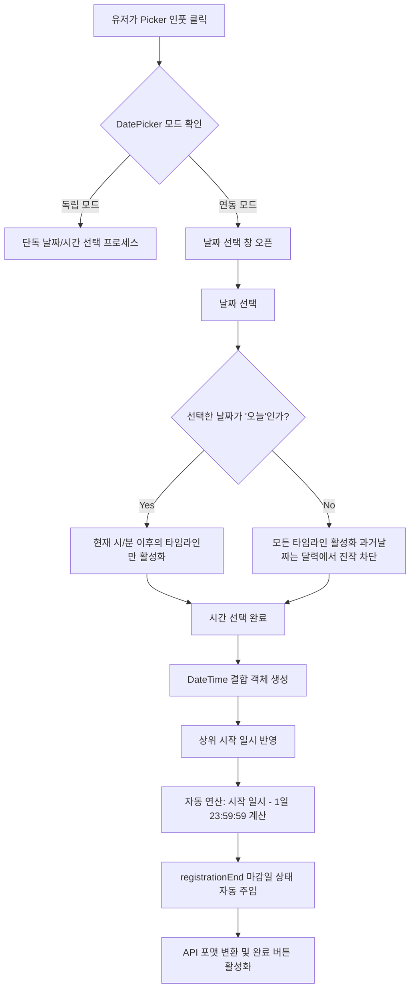

# DatePicker 기능 명세 및 설계

- **상태:** Completed (완료)
- **작성자:** 도윤
- **최초 작성일:** 2026-05-21
- **최종 수정일:** 2026-05-26 (대규모 수정시 20260526_datePicker-flow-v2_doyun.md로 새 파일 생성)

### 변경 이력

- 2026-05-21: 초기 스펙 문서 작성
- 2026-05-26: 초기 문서 정리, 패키지 검토 및 다이어그램으로 플로우 시각화

# [Technical Specification] 공유형 Date & Time Picker 컴포넌트 구축 및 연동 설계

## 1. 개요 및 목표

(해당 프로젝트의 최종 목적과 비즈니스적 가치 설명)

메인 페이지와 모임 만들기 페이지에서 공통으로 사용할 `날짜`와 `시간 선택 컴포넌트`를 `단독` 혹은 `연동` 가능한 형태로 구축한다.
특히 모달이나 `overflow:hidden` 제한이 걸린 까다로운 부모 레이어 안에서도 화면이 잘리지 않고 안정적으로 렌더링되는 picker 세트를 제공하여, 유저의 이탈을 막고 유연한 모임 생성을 지원하는 것을 목표로 한다.

## 2. 범위 및 비범위

### 2.1 scope

- **날짜 및 시간 선택의 독립/연동 지원**
  - 날짜+시간 연동하여 사용하는 경우와 각 컴포넌트 독립적으로 사용하는 경우를 모두 지원하여 재사용성 극대화
- **실시간 유효성 검사**
  - 오늘 기준 이전 날짜들은 선택할 수 없도록 자동 비활성화
  - 오늘 기준 이미 지난 시간(시/분)은 선택할 수 없도록 자동 비활성화
- **모집 마감일 자동 계산**
  - 모집 마감일은 시작 일시 기준으로 하루 전 23:59로 자동 설정
- **사용자 경험(UX) 및 인터랙션**
  - 바깥 영역 클릭(Click Outside) 시 닫힘: 포커스를 잃으면 저장하지 않고 닫는 것이 기본 동작으로하여 구현
  - 폼 에러 방지를 위해 선택이 선행 입력되지 않으면 완료 버튼 막기
- **시스템 호환성 및 안정성**
  - 부모 화면 밖으로 잘리지 않고 렌더링
  - API 전송을 위한 ISO 8601 string 포맷 함수 제공
  - 단위 테스트 수행

### 2.2 Out-of-Scope

- 데이터를 전송하는 api 기능은 제외 (상위 Form 컨텍스트에 위임)
- 통합 테스트

---

## 3. 아키텍처 및 설계

### 3.1 컴포넌트 렌더링 전략

- 사용하는 부모 페이지는 서버 컴포넌트 구조를 유지하여 서버 사이드 데이터 패칭 등 이점을 가져가고, 컴포넌트를 분리하여 최소한의 영역만 클라이언트 사이드 렌더링('use client')으로 수행되도록 설계

### 3.2 시스템 영향도

- shared 컴포넌트 중 새롭게 추가된 기능이라 기존 시스템에 영향 없음

### 3.3 실패 케이스 및 예외 처리 전략

| 실패/예외 케이스                  | 구체적 현상                                                                                                               | 대응 전략                                                                                                                                           |
| :-------------------------------- | :------------------------------------------------------------------------------------------------------------------------ | :-------------------------------------------------------------------------------------------------------------------------------------------------- |
| 타임존 파싱 오류                  | 서버(UTC)와 클라이언트(KST) 간의 9시간 시차로 인해, 유저가 선택한 날짜가 하루 전/후로 밀려서 저장되는 현상                | 클라이언트 UI 단에서는 브라우저 로직(Local)으로 보여주되, 최종 API 직렬화 시점에만 date-fns/tz 또는 toISOString()을 이용해 명확한 UTC 규격으로 변환 |
| 윤년(Leap Year) 및 월말 연산 오류 | 2월 29일이나 31일이 포함된 달에서 마감일을 '하루 전'으로 연산할 때 범위를 벗어나는 에러                                   | 하드코딩된 일수 계산(-1)을 지양하고, date-fns의 subDays(date, 1) 처럼 검증된 라이브러리의 날짜 객체 연산 메서드만 사용                              |
| 실시간 시간 역전 현상             | 밤 11시 59분에 픽커를 열어두고 1분이 지나 12시 00분(다음날)이 되었을 때, '오늘'의 과거 시간이 그대로 활성화되어 있는 현상 | 시간 선택 창을 열거나 스크롤할 때마다 new Date()를 기준으로 활성화 여부를 재평가하는 Lazy Evaluation 적용                                           |
| 부모 레이어 잘림 현상 (Overflow)  | 상위 다이얼로그나 스크롤 영역 내부에서 Picker가 호출될 때 UI가 잘리거나 스크롤이 생기는 현상                              | React 18+ Portal 기술을 활용하여 document.body 바로 아래로 렌더링 위치를 격리하고, 부모 엘리먼트의 좌표(getBoundingClientRect)를 추적하여 동적 배치 |

---

## 4. 기술적 세부사항

### 4.1 API 명세

같이달램 API의 데이터 형식을 기준으로 통일 ISO string (YYYY-MM-DDTHH:mm:ss.SSSZ)

| 필드명          | 타입                   | 설명             | 예시                       |
| :-------------- | :--------------------- | :--------------- | :------------------------- |
| dateTime        | string (ISO 8601, UTC) | 이벤트 시작 일시 | "2026-02-01T14:00:00.000Z" |
| registrationEnd | string (ISO 8601, UTC) | 등록 마감 일시   | "2026-01-31T23:59:59.000Z" |

### 4.2 사용 라이브러리

| 항목         | 선택 기술        | 선택 이유                                                                                                         |
| :----------- | :--------------- | :---------------------------------------------------------------------------------------------------------------- |
| Calendar UI  | react-day-picker | 가볍고 커스텀 마크업과 스타일링이 자유로워 UI 제작에 적합                                                         |
| Date Utility | date-fns         | 기존 프로젝트에 기도입된 날짜 유틸리티와의 일관성(Convention)을 유지하고, 불필요한 번들 크기 증가를 방지하기 위함 |

### 4.3 미사용 라이브러리 비교

- **Calendar UI 대안군 검토**
  - **대안A: mui/date-picker**
    - MUI 기반으로 UI가 제공되어 빠르게 구현할 수 있지만 같이 설치해야하는 의존성 패키지들이 많아 무거움
  - **대안B: react-day-picker(채택)**
    - headless 느낌으로 마크업과 스타일 커스텀이 자유로움, WAI-ARIA 웹 접근성을 기본 지원하여 안정적임

### 4.4 패키지 버전 및 안정성 검토

도입 예정인 핵심 라이브러리의 유기적 연동 및 React 19(또는 Next.js 최신 환경)와의 호환성을 검증한다.

```JSON
{
  "dependencies": {
    "react-day-picker": "^10.0.1",
    "date-fns": "^4.1.0"
  }
}
```

- **버전 변경에 따른 핵심 검토 사항**
  - **react-day-picker v10 패키지명 변경**
    - v10부터는 npm 설치 및 import 경로가 react-day-picker가 아니라 @daypicker/react로 변경되는 패키지 구조 개편
    - 스타일 가져오는 경로도 import "@daypicker/react/style.css"로 변경
  - **date-fns v4의 타임존(Timezone) 자체 지원**
    - 이전 버전에서 타임 존 처리 시 별도 라이브러리 설치, v4부터는 내장 기능(@date-fns/tz)으로 지원하여 실패케이스 방어에 유리

    ```typescript
    // utils.ts 예시 패턴
    import { format } from "date-fns";
    import { tz } from "@date-fns/tz"; // date-fns v4 신기능!

    // API 전송용 UTC 포맷팅 시 v4 내장 타임존 기능 적극 활용
    export const formatToUTC = (date: Date) => {
      return format(date, "yyyy-MM-dd'T'HH:mm:ss.SSSX", { in: tz("UTC") });
    };
    ```

- **검토 사항**: 두 패키지 모두 React 19 패키지 구조 및 Peer Dependencies와 아무런 경고 없이 깔끔하게 매칭

---

## 5. 시스템 흐름 및 다이어그램

### 5.1 날짜/시간 연동 및 유효성 검사 흐름도 (Mermaid)

유저가 날짜를 선택하고 시간을 설정할 때, 내부 상태가 어떻게 유기적으로 변하고 유효성을 판단하는지 흐름을 시각화한다



### 5.2 컴포넌트 구조 및 데이터 흐름

서버 컴포넌트 영역을 최대한 보존하고 인터랙션이 일어나는 핵심 Picker 영역만 클라이언트 사이드('use client')로 분리하는 구조적 설계.

```
[Server Component: 모임 만들기 Page / 메인 Page]
   │ (서버 사이드 데이터 패칭 & 기본 SSR 레이아웃)
   ▼
[Client Component: Form Wrapper] ── (State 관리: dateTime, registrationEnd)
   │
   ├──► [Client Component: DatePicker 팝업 트리거 인풋]
   └──► [Portal Layer: document.body]
           ├── [CalendarPicker] (react-day-picker 베이스 UI)
           └── [TimePicker] (시/분 가상 스크롤 Selector)
```

---

## 6. 테스트 및 배포 전략

### 6.1 단위 테스트

#### 날짜 포맷팅 함수 검증:

- 선택된 날짜가 인풋에 "yyyy-MM-dd" 형태로 입력되는지 테스트
- 선택된 시간이 오전일 경우"0n:00" 형태로 입력되는지 테스트
- 선택된 날짜 객체(Date)를 API 스펙에 맞게 2026-02-01T14:00:00.000Z 형태로 정확히 변환(ISO 8601)하는지 테스트.

#### 유효성 검사(Validation) 로직 검증:

- **날짜 제약**: 과거의 날짜는 아예 선택 불가능하도록 달력 자체에 disabled 속성을 적용한다.
- **시간 제약**: 오늘 날짜를 선택했을 경우, 현재 실시간 타임라인을 체크하여 이미 지나간 '시'와 '분' 버튼은 클릭할 수 없도록 유기적으로 막는다.
- **빈 값 제출 방어**: 날짜나 시간이 선택되지 않은 채로 [적용]/[확인] 버튼이 눌리면 상위 페이지 단에서 에러가 터지므로, 컴포넌트 내부에서 필수 값이 비어있을 땐 아예 액션 버튼을 disabled 처리한다.

---

## 7. 컴포넌트 구조 설계

```
shared/
  └── ui/
    └── DatePicker/
      ├── CalendarPicker.tsx
      ├── TimePicker.tsx
      ├── usePicker.ts   // 공통 훅: 열림/닫힘 상태 관리 및 Portal 위치 계산
      ├── useTimePicker.ts // TimePicker 내부 상태 및 useCallback 훅
      ├── utils.ts // 포맷팅 및 시간 비교 패턴 전용 순수 함수
      └── types.ts
app/
  └── temp/
      └── datePickerView/
        └── page.tsx // 미리 보기(날짜+시간 상태 연동)
```

### 7.1 설계 포인트:

- **관심사 분리**: 픽커 컴포넌트 본체는 UI 마크업에만 집중하고, 팝업 위치를 잡거나 시간 스크롤을 조작하는 무거운 로직은 각각 커스텀 훅으로 위임하여 가독성을 높인다.
- **중복 상태 배제**: 부모에게 전달받은 상태값(Props)이 있으면 그걸 우선으로 쓰고, 없을 때만 내부 상태(State)를 쓰도록 처리해서 데이터 싱크가 꼬이는 버그를 방지한다.

---

## 8. 마일스톤 및 일정

| 설명            | 소요 |
| :-------------- | :--- |
| UI 구현         | 1일  |
| 기능개발&테스트 | 2일  |
| 리팩토링        | 1일  |

---

## 9. 질문
